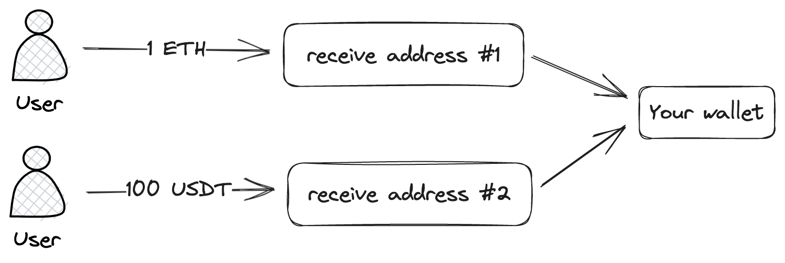

# Receive addresses

## Introduction



In order to receive payments from your client you should give him address, so he can deposit his assets to the address. After Curra will detect that income is confirmed on address, assets will be automatically forwarded to your configured address.

> 📖 **Notes on addresses**
> 
> Each address has it's own index, can be treated as id. Each address is deterministically calculated using these indexes and same on different EVM chains. That mean you can use same addresses on various supported EVM blockchains


## Quick start

Before you can create addresses, you should [authorise](../security/api_authorization.md).

### JS/TS SDK

Create new receive address:

```
const address = await curra.getNextAddress()
```

Create new receive address by it's index:

```
const address = await curra.getAddress(6)
```

### HTTP

**Create new address**:

method: `POST`\
endpoint: `/forwarders/next`\
body: `{}`

**Create or get address by index (salt):**

method: `POST`\
endpoint: `/forwarders`\
body: `{ salt: number }`. *example:* `{ salt: 6 }`
