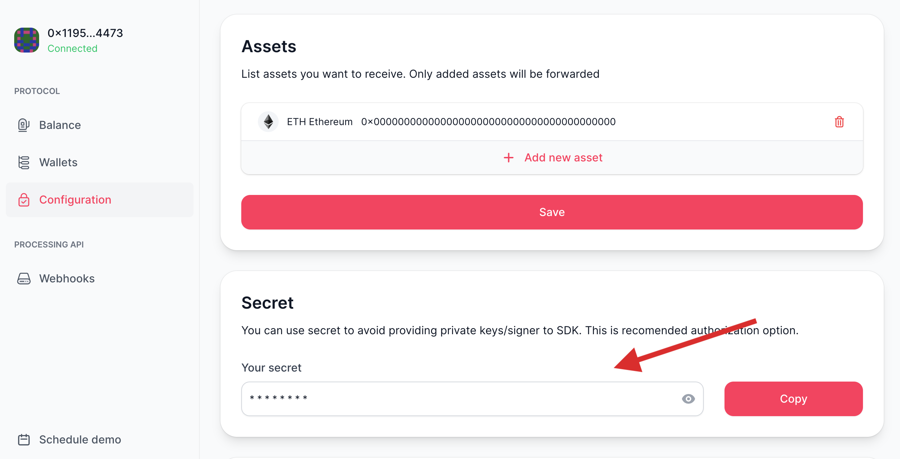

# API authorization

## Non-custodial nature

Curra API is operated by Coordinator, which indexes various blockchains to obtain data related to Curra features. API is completely non-custodial and does not require your private keys to work. You can treat it as "read-only".

## Obtain API secret

To get API secret you should complete onboarding on Curra <a href="https://app.curra.io" target="_blank">application</a>.
After that, secret can be obtained on <a href="https://app.curra.io/configuration" target="_blank">configuration page</a>:




### JS/TS SDK

Blockchain values:

- `Blockchain.GOERLI` – Goerli blockchain
- `Blockchain.ETHEREUM` – Ethereum mainnet blockchain
- `Blockchain.BSC` – Binance Smart Chain blockchain
- `Blockchain.POLYGON` – Polygon blockchain

Install SDK:

```
npm i @curra/sdk
```

Create `CurraCoordinator` instance:

```
const { Blockchain, CurraCoordinator } = require("@curra/sdk");

const curra = CurraCoordinator.fromSecret({
  blockchain: Blockchain.GOERLI,
  secret: "YOUR_SECRET",
  ownershipId: "YOUR_OWNERSHIP_ID"
});
```

### HTTP

Construct blockchain-specific API URL. Replace `{blockchain}` with desired blockchain:
`https://{blockchain}.coordinator.curra.io`

Blockchain URLs:

- Ethereum – `https://ethereum.coordinator.curra.io`
- Polygon – `https://polygon.coordinator.curra.io`
- Goerli – `https://goerli.coordinator.curra.io`
- Binance Smart Chain – `https://bsc.coordinator.curra.io`

Add following headers to authorise your HTTP request:

- add `OWNERSHIP: your_ownership_nft_id` header
- add `SECRET: your_secret` header

HTTP request example to create an address on Ethereum blockchain:

```
POST /addresses/next
HOST: https://ethereum.coordinator.curra.io
SECRET: your_secret
OWNERSHIP: your_ownership_id
```
